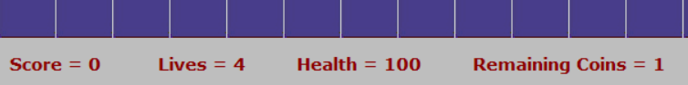

# Pacman-Like-Game
## User Manual
1) Open 'PT-Project' and run it.
2) In the grid mode choose the layout as you desire by clicking **once** on the desired cell from the toolbar and then **double** click on the desired grid cell location. 
*Make sure you click only once on the chosen cell in the toolbar and check for the confirmation on your action in the status bar then double click on the desired grid location. Not doing this sequence and number of clicks with throw an error and you will need to start over*. 
*The image below shows the message appearing on the status bar (on the bottom) after clicking once on the coin symbol on the toolbar waiting for choosing the desired grid cell location* 

      
3) After completely choosing the entire layout of the game and you are ready to start playing, click on the 'Ps controller' symbol in the toolbar to start the game mode.
4) While playing you can see your progress in the status bar as shown in the image below. 

