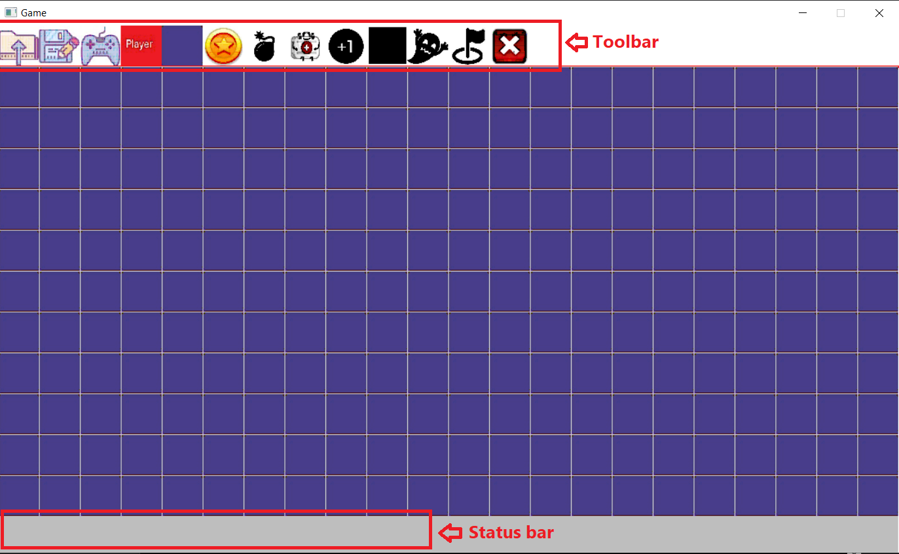
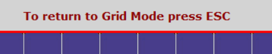

# Pacman-Like-Game
## Project Overview

This is a simple game application. The general idea of the game is a player moving in a grid of cells having obstacles cells in addition to other types of cells. The player has health and lives and game is only one level. 

Game Target:
The player is required to collect a number of items and reach a goal cell.

Game Result:
Win: The player could collect all the required items and reaches the goal cell.
Loss: The player lost all his lives.

The application supports 2 modes: **Grid Mode** and **Game Mode**. 
In grid mode, the user interacts with the application through the menu icons that are in tool bar (top of the window). The application should also provide a status bar that to print messages to the user and to display game progress. 

The player is moving in a grid that is divided into a number of cells; a cell is specified by its row and column. 

   

## Cell Types
## User Manual
1) Open 'PT-Project' and run it.
2) In the grid mode choose the layout as you desire by clicking **once** on the desired cell from the toolbar and then **double** click on the desired grid cell location. 
*Make sure you click only once on the chosen cell in the toolbar and check for the confirmation on your action in the status bar then double click on the desired grid location. Not doing this sequence and number of clicks with throw an error and you will need to start over*. 
*The image below shows the message appearing on the status bar (on the bottom) after clicking once on the coin symbol on the toolbar waiting for choosing the desired grid cell location* 

      
3) After completely choosing the entire layout of the game and you are ready to start playing, click on the 'Ps controller' symbol in the toolbar to start the game mode.
4) While playing you can see your progress in the status bar as shown in the image below. 

      
5) If in the middle of the game you decide you want to edit the grid you cn return to the grid mode using escape button on your keyboard as mentioned in the toolbar in the game mode as illustrated in the image below. 

      
